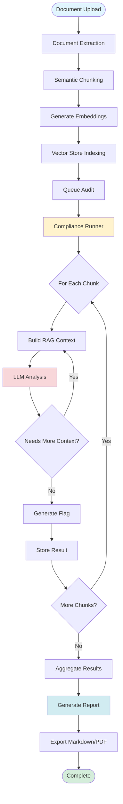
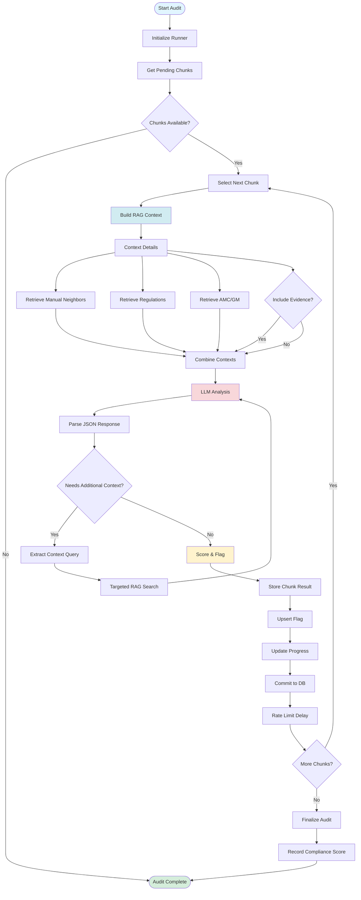
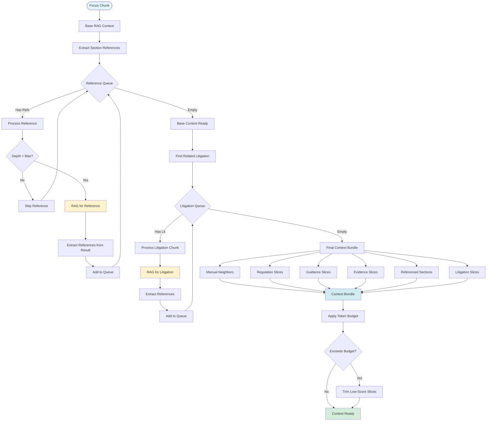
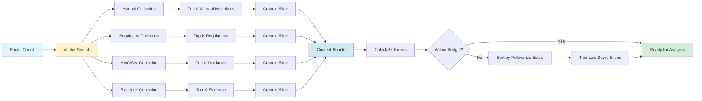
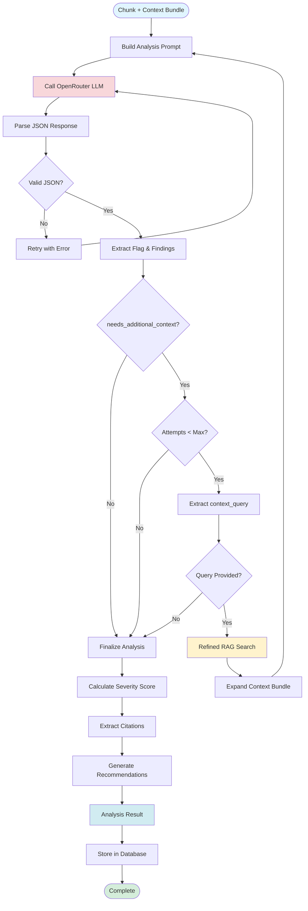
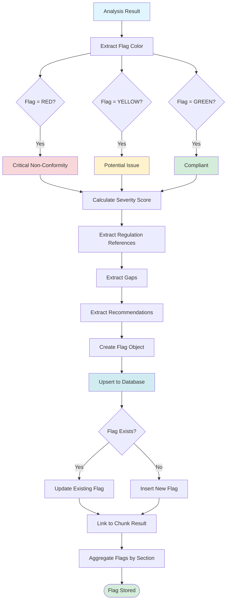
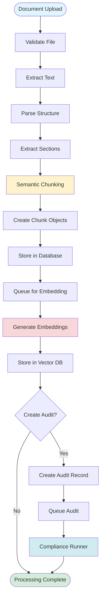
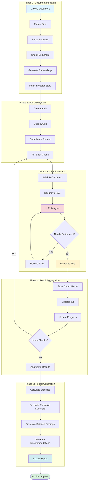
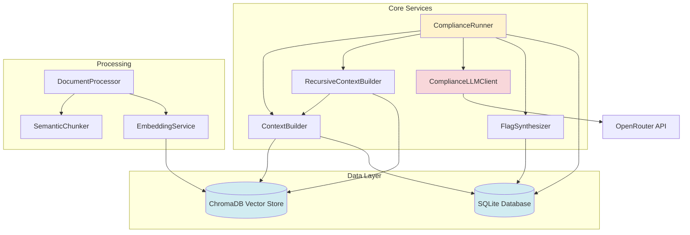

# Agentic Engine Flowcharts

This document contains beautiful flowcharts visualizing the agentic compliance auditing engine.

## 1. High-Level System Architecture

## 2. Compliance Runner - Chunk Processing Flow

## 3. Recursive RAG Context Building

## 4. Context Retrieval Process

## 5. LLM Analysis & Refinement Loop

## 6. Flag Generation & Synthesis

## 7. Document Processing Pipeline

## 8. Complete End-to-End Flow

## Component Interactions

## Legend

- 🔵 **Blue**: Start/End points
- 🟢 **Green**: Successful completion
- 🟡 **Yellow**: Processing/Transformation steps
- 🔴 **Red**: Critical operations (LLM calls, analysis)
- 🔷 **Light Blue**: Data storage/retrieval

---

*Generated for Junction25 AI Auditing System*

